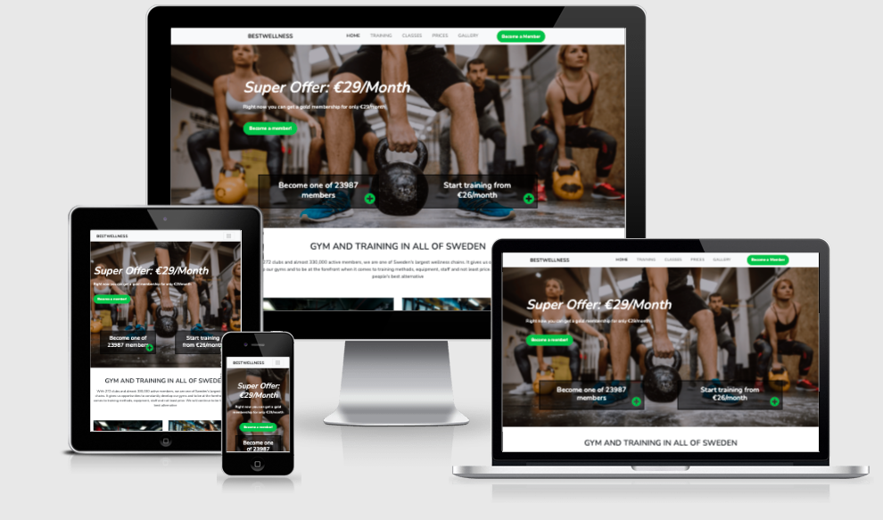

# [Best Wellness website](https://mrmorkeberg.github.io/BestWelness/)

Website presents the gym Best Wellness, their services, and the gym itself.
Potential members will be able to see pictures of the gym, see the classes the gym offers, and read about the benefits of going to the gyn

# Table of content

- [UX](#ux) 

    - [Website owners goals](#website-owners-goals)

    - [User goals](#user-goals)

        - [Potential gym member](#potential-gym-member)

        - [Retaining members](#retaining-members)
    
    - [User stories](#User-stories)

        - [As a potential gym member](#as-a-potential-gym-member)

        - [As a gym member](#as-a-gym-member)

    - [Design choises](#design-choises)

        - [Colors](#colors)

        - [Fonts](#fonts)

        - [Images](#images)

        - [Wireframes](#wireframes)

- [Features](#features)

- [Technologies Used](#technologies-used)

# User Experience (UX)

## Website owners goals

The Website owners goals it to build their brand, attract potential members, to keep present members and to inform the members about what is happening in the gym, when there are classes and about new offers.

## User goals

### **Potential gym member**

The goal is to attract potential members so that they become members by showing them what the Gym has to offer and the benefits of training

### **Retaining members**

The goal is to retain members of the Gym by showing them what goes on in Gym. 

## User stories

### **As a potential gym member:**

- I want to easily understand what the gym has to offer as to the gym itself (machines) which group training they are offering
- I want to find the prices and the location of the gym
- I want to find the opening hours for the gym
- I want to find pictures of the gym
- I want to find the best way to get in contact with the gym
- I want to find the schedule of the group classes

### **As a gym member:**

- I want to easily find the schedule of the group training
- I want to book group classes
- I want to see new offers
- I want to see pictures of what is happening in the gym

## Design choices

### **Colors**

- Main background color is white
- Text color is black
- Button color is #54b848 
- Hover color on menu is #54b848
- Copyright section background color is bg-dark 

### **Fonts**

Main font is Nunito from google fonts with font sans-serif as backup. 

### **Images**

Images is bought from freepik. The images are credited in [credits](#credits) section. Images are very important, as they are showing the gym, equipment and services which are the sellingpoints. The large background image is chosen to catch the users attention and to show what the website is and what it can offer. 

### **Wireframes**

I used Balsamiq Wireframes to create the Wireframes

- Desktop Wirefram  - [View](assets/wireframs/desktop.pdf)
- Tablet Wirefram - [View](assets/wireframs/tablet.pdf)
- Mobile phone Wirefram - [View](assets/wireframs/Mobilephone.pdf)

# Features

The website is responsive and has interactive elements. The website consists of 6 pages. 5 are accessible from a navigation menu and 1 is the membership form, which is accessible from the: "Become a member" button.

The website has the following features:

## Navigation bar

#### Navigation bar is visiable on the top of each page and is responsive. It will adapt to mobile devices by changing into a burger menu.

* On the left side there is a logo with a link to the homepage. 
* On the right side there are 5 links to navigate to the other pages, which are:
    
    * Home 
    * Training
    * Classes 
    * Prices 
    * Gallery 

## Information about the gym

Each page has information about Opening Hours, Adress and Contact information near the bottom. 

## GoogleMap 

Under the information about the gym, each page has a google map that shows where the gym is.

## Footer

Footer is the same on each page and has social links in the center.
Each link will open in a separate tab in a browser.

## Features Left to Implement

* A payment solution on the Become a member page
* A online booking option on the Classes page
* Pictures in Gallery is clickable so the become bigger
* Pictures of the employees of the gym and a description of the person

# Technologies Used

### **Languages Used**

* #### HTML5
* #### CSS

### **Frameworks, Libraries & Programs Used**

#### Bootstrap 4.6.0 

* Bootstrap was used to keep the website responsive and help with the styling

#### Google Fonts 

* Google fonts was used to import the "Nunito" font into style.css and was used on all pages through the hole website

#### Font Awsome

* Font awsome was used as a icon library throughout the website

#### Git 

* Git was used for version control by utilizing the Gitpod terminal to commit to Git and Push to GitHub

#### GitHub

* Github was used as a software hosting platform to store the projects code after being pushed from Git

#### Gitpod

* Gitpod was used as a development hosting platform

#### Photoshop

* Photoshop was used to resizing images and editing pictures for the website.

#### Balsamiq

* Balsamiq was used to create the wireframes during the design process.

#### ami.responsivedesign

* Am I Responsive was used to do the Mockup.

# Testing

The W3C Markup Validator and W3C CSS Validator Services were used to validate every page of the project.

Chrome developer tools was used throughout the project for testing and solving problems with responsiveness and style issues.

## Testing User Stories from User Experience (UX) Section

### **As a potential gym member:**

- I want to easily understand what the gym has to offer as to the gym itself (machines) which group training they are offering 

    - When entering the site you can easily see in the menu Training and Classes. 
    - The hero images also shows what Best Wellness offers
    - If you scroll down you can read about some of the things the gym offers (crosfitt and personaltrainer)

- I want to find the prices and the location of the gym

    - On the Hero images you can se a price offer 
    - In the menu on the top you can see the menu item Prices where you can find all the prices
    - The location of the gym is found on the bottom of all pages, both as an address and on a map

- I want to find the opening hours for the gym

    - The opening hours is at the bottom on all pages, right beside the address 

- I want to find pictures of the gym

    - In the menu there is the menu item Gallery, where you can see pictures of the gym

- I want to find the best way to get in contact with the gym

    - In the bottom of all pages, beside the adress, you will find Contact us, where there are phone number and mail address

- I want to find the schedule of the group classes

    - In the menu there is the menu item Classes, where you can find all the classes and the time for them

### **As a gym member:**

- I want to easily find the schedule of the group training

    - In the menu there is the menu item Classes, where you can find all the classes and the time for them

-  I want to book group classes

    - That feature isn't available yet. But is in Features left to Implement

- I want to see new offers

    - On the homepage, members can see new offers

- I want to see pictures of what is happening in the gym

    - In the Gallery section new pictures will be posted continuously, so that members can keep track of what is happening att the gym

## Further Testing

- The Website was tested on Google Chrome, Internet Explorer and Safari browsers.

- The website was viewed and tested across multiple virtual mobile devices and browsers. I checked all supported devices in Chrome developer tools.

- Testing was done to ensure that all pages were linking correctly.

- Friends were asked to review the site and to point out bugs and/or user experience issues. 

- The website was viewed many times and margins was changed to give a better user experience.

## Known bugs

- When resizing the screen to check responsiveness, there are breakpoints where the text and the icons in the bannerbox overlap. 

## Deployment

The project was deployed on GitHub pages. I used Gitpod as a development environment where I commited all changes to git version contorl system. I used push command in Gitpod to save changes into GitHub. 

To deploy the project to Github I used the following steps:

- Log into Github and locate the right repository 
- Click on the repository 
- Click on settings on the top right side, a menu will open on the left side
- Find pages in the menu on the left side, second last from the bottom
- Click on pages
- Under "Source, click the dropdown called "None" and select "Master Branch"
- Click save and the pages will deploy after auto-refresh
- After that there will be a link under GitHub pages that says: Your site is published at Your site is published at https://mrmorkeberg.github.io/BestWelness/

# Credits

-  To complete this project I used Code Institute student template: gitpod full template

- Ideas and knowledge library:

    - w3schools.com

    - stackoverflow.com

    - getbootstrap.com/docs

    - https://web.dev/

## Code 

- Bootstrap 4.6.0 library used throughout the project to make the site responsive using the Grid system and the code for Navbar, buttons and some styling

- The code for social media styling on line 116 and 153 was taken from w3schools.com/howto/howto_css_social_media_buttons.asp

- The map was taken and embedded from Googlemaps 

## Content

Content was taken from nordicwellness.se/ and translated into english

## Media

All images was bought from freepik.com

Credit to:

- master1305
- artroomstudio
- starush
- yanalya
- ufabizphoto
- prostooleh
- krisikorn
- oneinchpunch
- rawpixel
- freepik
- branin
- prostock-studio
- wavebreakmedia
- dusanpetkovic
- Pekic

## Acknowledgements

- My Mentor for continuous helpful feedback.

- Tutor support at Code Institute for their support.